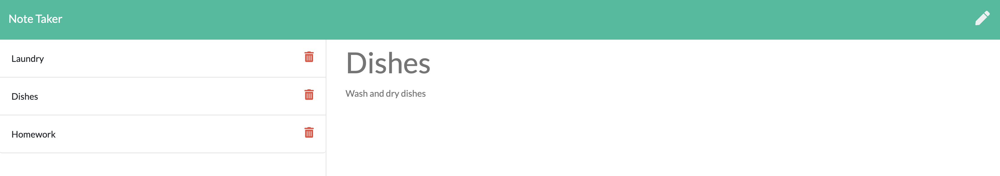

# Note Taker

  ## Description
  This application allows users to quickly add, edit and delete any tasks that they need to accomplish. It is built and run using express.js and deployed using Heroku. The deployed application can be found [here](https://note-taker-14.herokuapp.com/).

  ## Table of Contents

  * [Installation](#installation)
  * [Usage](#usage)
  * [Contributing](#contributing)
  * [Tests](#tests)
  * [Questions](#questions)

  ## Installation
  If you would like to install this application to run on your local machine, you will need node installed. You can clone the repo found [here](https://github.com/squidbeaks/note-taker). Run npm install to download needed packages and run `npm start` to get the app up and running on your machine locally.

  ## Usage
  To use the application, users can visit the site and click on the Get Started link. Users can type in a title and text into their tasks and click the save button. To view a specific task, they need to click the title of the task they want to view. To delete the task, they can select the trash icon next to the item they wish to delete.
  

  ## Contributing
  To contribute to this application, please create a Github issue or create a Pull Request with your proposed changes.

  ## Tests
  To run tests, ensure `jest` has been installed as a package dependency on your machine. Once that is done, you can run the test suite by running `npm run test`. The results will populate in your terminal.

  ## Questions?
  Reach me at [Github](https://github.com/squidbeaks) or [email](leahsigridrussell@gmail.com)!
